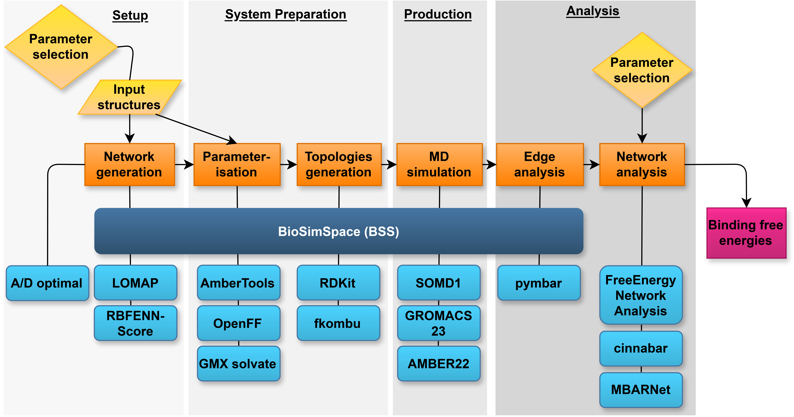

# RBFE Benchmark

Files and scripts for Modular and Interoperable Workflows for Benchmarking Alchemical Binding Free Energy Calculation Methodologies.
For full details, please see the main manuscript, available at: 

**analysis** - contains the ipynb used to generate the analysis and figures for the main manuscript.

**inputs** - contains the parameterised proteins and the ligand structure files, generated networks, predicted network performance, and experimental values.

**results** - contains the csv files of the edge and ligand results for each system.

**pipeline** - contains the code and scripts used for setting up, running, and analysing the simulations.

Below is an outline of the pipeline:

In order to run the RBFE bechmark, please follow instructions in the `pipeline` folder.
